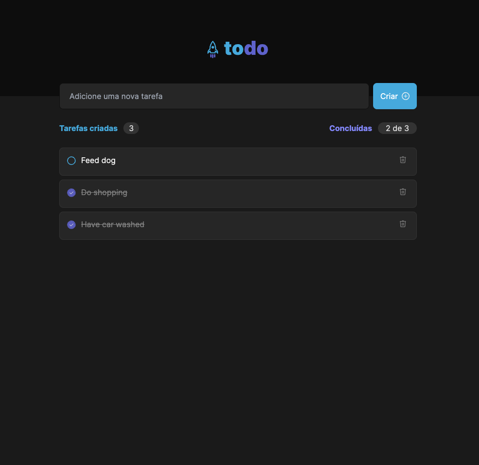
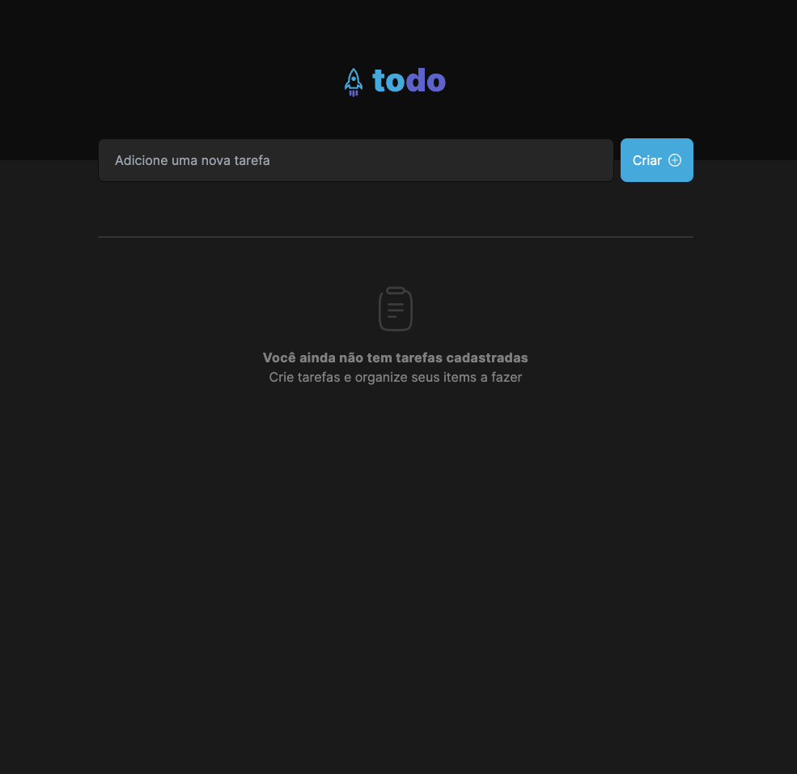

## Ignite Todo List

 

### Tecnologias usadas

O projeto foi desenvolvido usando [React.js](https://react.dev/) e [Vite](https://vitejs.dev/)
junto com [TailwindCSS](https://tailwindcss.com/) para estilizar a aplicação.

### License
© Feito com muito &#10084; por Hugo Ramon Pereira -> [Portfolio](https://hugoramonpereira.dev/) -> [LinkedIn](https://www.linkedin.com/in/hugo-ramon-pereira/) 🇧🇷 durante o desafio do curso da [Rocketseat](https://www.rocketseat.com.br/)

